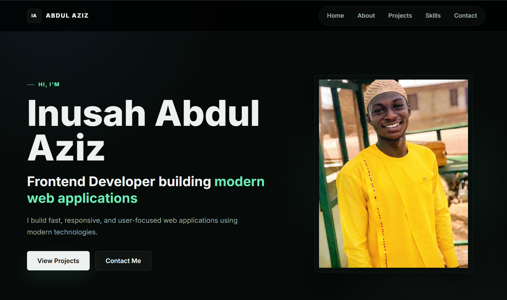

# Inusah Abdul Aziz - Frontend Developer Portfolio

A modern, professional portfolio website showcasing frontend development skills, structured problem-solving approach, and commitment to impactful technology solutions.



---

## Table of Contents

- [Quick Start: Adding / Updating Projects](#quick-start-adding--updating-projects)
- [Project Data Format Reference](#project-data-format-reference)
- [Introduction](#introduction)
- [Tech Stack](#tech-stack)
- [Design System](#design-system)
- [File Structure](#file-structure)
- [Setup Instructions](#setup-instructions)
- [Deployment Guide](#deployment-guide)
- [Contact Information](#contact-information)

---

## Quick Start: Adding / Updating Projects

All projects are stored in one file: **`js/projects-data.js`**.  
You do **not** need to touch `index.html` or `projects.html`.

### Add a new project

1. Open `js/projects-data.js`.
2. Scroll to the `projects` array (starts at line 1).
3. Copy the template below, paste it **before** the closing `];`, and fill in your details.
4. Save a screenshot to `assets/images/` (recommended `800×450px`, 16:9).
5. Refresh the browser — the new project appears automatically on both pages.

### Update an existing project

Find the project object inside the `projects` array and change any property (`title`, `summary`, `image`, `tech`, `liveUrl`, `githubUrl`, etc.).

### Remove a project

Delete the entire object from the array. Make sure commas between remaining objects are still valid.

---

## Project Data Format Reference

Every project is a JavaScript object inside the `projects` array.

### Required fields

| Field | Type | Purpose |
|---|---|---|
| `id` | string | Unique anchor used in URLs (`projects.html#my-project`). |
| `number` | string | Display number on the project detail page (e.g. `"06"`). |
| `title` | string | Project name shown on cards and detail pages. |
| `summary` | string | One-line description shown on the home page grid. |
| `category` | string | One of: `educational`, `corporate`, `design-system`, `interactive`, `form-design`. |
| `image` | string | Path to the screenshot in `assets/images/`. |
| `tech` | array | List of technologies, e.g. `["HTML", "CSS", "JavaScript"]`. |
| `liveUrl` | string | Live demo URL — use `"#"` if not deployed. |
| `githubUrl` | string | GitHub repository URL. |
| `details` | array | Rich content blocks rendered on `projects.html`. |

### `details` block formats

Use **either** `content` (paragraphs / HTML) **or** `list` (bullet points):

```javascript
// Paragraph format (supports HTML tags like <p> and <strong>)
{
  heading: "<i class="fa-solid fa-bullseye"></i> The Real Problem",
  content: "<p>Describe the problem in <strong>one or more paragraphs</strong>.</p>"
}

// List format (auto-bolds text before the first colon)
{
  heading: "<i class="fa-solid fa-lightbulb"></i> Key Solutions Delivered",
  list: [
    "Feature One: What was built and why it matters.",
    "Feature Two: How it helps the end user."
  ]
}
```

### Quick copy-paste template

```javascript
{
  id: "your-project-id",
  number: "07",
  title: "Project Title",
  summary: "One sentence describing what this project does and who it helps.",
  category: "interactive",
  image: "assets/images/your-screenshot.png",
  tech: ["HTML", "CSS", "JavaScript"],
  liveUrl: "#",
  githubUrl: "https://github.com/yourusername/your-repo",
  details: [
    {
      heading: "<i class="fa-solid fa-bullseye"></i> The Real Problem",
      content: "What problem does this solve for users?"
    },
    {
      heading: "<i class="fa-solid fa-building"></i> How I Approached It",
      content: "<p><strong>Step 1:</strong> What you did first.</p><p><strong>Step 2:</strong> How you structured it.</p>"
    },
    {
      heading: "<i class="fa-solid fa-lightbulb"></i> Key Solutions Delivered",
      list: [
        "Solution 1: What feature was built.",
        "Solution 2: What benefit it provides.",
        "Solution 3: How it helps users."
      ]
    },
    {
      heading: "<i class="fa-solid fa-rocket"></i> What I Learned as a Developer",
      content: "<p>Your key learnings from this project.</p>"
    }
  ]
}
```

### Rules to avoid common errors

- **Commas**: Add `,` after every project object **except** the last one in the array.
- **Unique IDs**: Every `id` must be unique across all projects.
- **Image paths**: The `image` path must match the actual file inside `assets/images/`.
- **Valid categories**: Use only the five predefined categories listed above.
- **Quotes**: Keep all string values wrapped in quotes.

---

## Introduction

This portfolio represents the professional work of Inusah Abdul Aziz, an IT student and frontend developer focused on building structured, meaningful digital solutions. The website serves as both a showcase of technical skills and a demonstration of engineering principles applied to web development.

### Key Characteristics

- **Clean Architecture**: Component-based CSS with semantic HTML
- **Responsive Design**: Mobile-first approach with fluid layouts
- **Performance Focused**: Optimized assets and efficient code structure
- **Accessible**: Semantic markup and keyboard navigation support
- **Maintainable**: Well-documented code with clear organization

---

## Tech Stack

### Frontend Technologies

- **HTML5**: Semantic markup and accessibility standards
- **CSS3**: Modern layout techniques (Grid, Flexbox, Custom Properties)
- **JavaScript (ES6+)**: Vanilla JS for interactive functionality

### Design & Workflow Tools

- **Figma**: UI/UX design and prototyping
- **Git & GitHub**: Version control and collaboration
- **VS Code**: Development environment
- **Netlify / Vercel**: Deployment and hosting platforms

### Currently Learning

- **React**: Component-based frontend frameworks
- **Tailwind CSS**: Utility-first CSS framework
- **Node.js**: Server-side JavaScript runtime
- **APIs & Backend**: Full-stack development fundamentals

---

## Design System

### Visual Identity

- **Theme**: Dark background with layered surfaces
- **Accent**: Teal/emerald (`#6ee7b7`) for interactive elements and highlights
- **Typography**: Inter system font stack
- **Style**: Soft borders, lift-on-hover cards, restrained glow effects

### Color System

```css
--background: #060a08;
--surface: #0c1210;
--card: #101a16;
--border: rgba(255, 255, 255, 0.07);
--text: #edf2f0;
--text-secondary: #9caea8;
--text-muted: #5f736b;
--accent: #6ee7b7;
--accent-deep: #34d399;
```

### Design Principles

- **Dark Theme**: Near-black background with subtle grid pattern overlay
- **Minimal**: Clean layout focused on content presentation
- **Structured**: Consistent spacing and typography hierarchy
- **Performance**: Preconnected fonts, preloaded critical CSS, lazy-loaded images

---

## File Structure

```
portfolio/
├── index.html                 # Main portfolio page (projects load dynamically)
├── projects.html              # Dedicated projects showcase page with filters
├── documentation.html         # Technical documentation website
├── README.md                  # This file
├── css/
│   └── style.css              # All styles: variables, layout, components, responsive
├── js/
│   ├── script.js              # Mobile menu toggle, scroll reveal animations, filtering
│   ├── docs.js                # Documentation sidebar navigation
│   └── projects-data.js       # Edit this file to add/update/remove projects
└── assets/
    ├── images/                # Screenshots and profile photos
    │   ├── aziz-profile.jpeg
    │   ├── abdul profile2.png
    │   ├── symbols-screenshot.png
    │   ├── revastech-screenshot.png
    │   └── calculator-screenshot.png
    └── icons/
        └── favicon.ico
```

### Architecture Decisions

- **Single CSS File**: All styles consolidated in `style.css` with logical sections
- **Component-Based**: Reusable patterns for cards, buttons, grids
- **Data-Driven Projects**: Project content lives in `js/projects-data.js`; HTML is generated automatically
- **Desktop-First**: Responsive design with max-width breakpoints
- **Performance**: Optimized images, IntersectionObserver for animations

---

## Setup Instructions

### Prerequisites

- Modern web browser (Chrome, Firefox, Safari, Edge)
- Code editor (VS Code recommended)
- Git for version control

### Local Development

1. **Clone the repository**
   ```bash
   git clone https://github.com/abinusah/portfolio.git
   cd portfolio
   ```

2. **Open in browser**
   - Open `index.html` directly, **or**
   - Use VS Code Live Server: install the extension, right-click `index.html`, choose "Open with Live Server"

### Development Workflow

1. Edit project data in `js/projects-data.js` (or update text/styles in HTML/CSS)
2. Refresh the browser to see changes
3. Test on multiple screen sizes
4. Commit and push when ready

---

## Deployment Guide

### Netlify

1. Connect the GitHub repository
2. Build command: *(leave empty)*
3. Publish directory: `/`
4. Deploy — pushes to `main` auto-deploy

### Vercel

1. Import the GitHub repository
2. Framework Preset: **Other**
3. Build Command: *(leave empty)*
4. Output Directory: `/`
5. Deploy — pushes to `main` auto-deploy

### Pre-deployment Checklist

- [ ] Test all links and navigation
- [ ] Validate HTML and CSS
- [ ] Optimize all images
- [ ] Test contact form submission
- [ ] Check responsive design on multiple devices
- [ ] Verify loading performance

---

## Contact Information

**Inusah Abdul Aziz**
- **Email**: abdulazizinusah82@gmail.com
- **GitHub**: [github.com/abdulaziz-cyber395](https://github.com/abdulaziz-cyber395)
- **LinkedIn**: [linkedin.com/in/inusah-abdul-aziz-988445328](https://www.linkedin.com/in/inusah-abdul-aziz-988445328)

---

*Built with HTML, CSS, and JavaScript • Designed for maintainability and performance • Focused on solving real-world problems through structured development*
